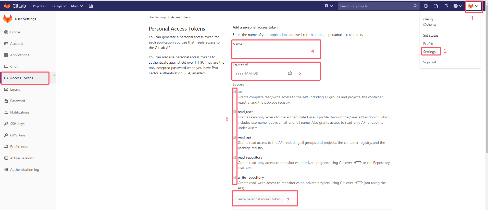
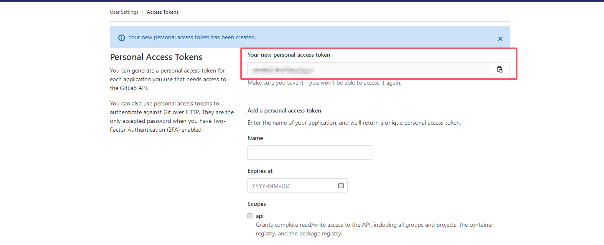
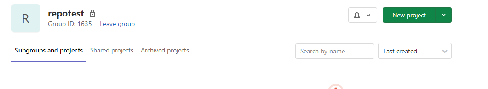

# 一、使用说明

### 1、执行 `build.sh`
```
./build.sh
```
### 2、进入 `output/bin` 目录，目录文件如下
```
output
└── bin
    ├── mirror_push.sh
    ├── repo_mirror_push
    └── setting.ini

```
# 3、配置 `setting.ini`
```
[UploadInfo]
upload=true                            	;是否执行仓库迁移
basePath=/home/img/code                 ;本地代码的路径
projectUrl=https://gitlab.example.com   ;目标gitlab地址,域名
apiToken=your_access_token              ;目标gitlab授权的API个人访问令牌
namespaceName=repotest                  ;远程仓库的根路径名称(无实际作用)
namespaceId=1635                        ;远程仓库的根路径id（仓库源码将提交到该路径下）

[XMLInfo]
outFile=example.xml                     ;将指定的XML以单文件的形式输出
basePath=/demo                          ;XML文件的路径
baseFile=xxx.xml                        ;预提交仓库的XML文件
```

> `XMLInfo.baseFile`: 预提交仓库的XML文件推荐使用命令`.repo/repo/repo manifest -m xxx.xml -o xxx.xml`生成的文件，而不是直接使用manifests下的文件。

> `apiToken`: gitlab个人账户授权的`apitoken`,通过点击右上角【用户头像】->选择【Edit profile】 ->菜单中选择【 访问令牌】，右侧 进行创建，建议给予全部权限




> `namespaceId`: 远程库根路径的ID,仓库源码将提交到此路径下



### 4、执行 `repo_mirror_push`

支持重复执行该指令，已创建的远程仓库或者已经提交过的仓库均不会被重复执行
```
./repo_mirror_push
```


### 5、`repo`工具以及`manifest`仓库自行上传到远程库根路径下

远程仓库目录结构如下：

```
repotest
├── manifest
├── repo
└── xxx
```

# 二、拉取代码
### 1、安装 repo命令
```
cd work
git clone https://gerrit.rock-chips.com:8443/repo-release/tools/repo
```
### 2、下载 manifest

```
# 通过 --repo-url 参数指定新的repo工具
./repo/repo init --repo-url  git@example.com:repotest/repo.git -u git@example.com:repotest/manifests.git -m demo.xml 

# 删除1步骤中安装的repo
rm -rf repo
```
### 3、同步代码
```
.repo/repo/repo sync -c
```
